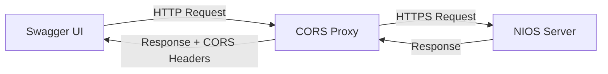

# NIOS WAPI CORS Proxy Server - User Guide

## Overview

The CORS Proxy Server enables you to use Swagger UI with NIOS WAPI by solving Cross-Origin Resource Sharing (CORS) issues. NIOS appliances don't provide CORS headers, which prevents web browsers from making direct API calls from Swagger UI.

This lightweight proxy server acts as a bridge between your browser and the NIOS appliance, adding the necessary CORS headers while forwarding your API requests securely.

## Quick Start

### 1. Start the Proxy Server

```bash
# Basic usage - default host:port (localhost:9000)
python cors_proxy_server.py

# Custom host and port
python cors_proxy_server.py --port 8000
```

### 2. Configure NIOS Server in Swagger UI

Set the **NIOS_Grid_IP** variable in Swagger UI to your NIOS server IP/hostname:
- Example: `192.168.1.100` or `nios.company.com`

### 3. Authenticate (Swagger UI Authentication Only)

Use the **"Authorize"** button in Swagger UI to enter your NIOS credentials.

## Command Line Options

| Option | Required | Default | Description |
|--------|----------|---------|-------------|
| `--port` | No | `9000` | Proxy server port |


## Usage Examples

### Basic Usage
```bash
# Start proxy with default settings (localhost:9000)
python cors_proxy_server.py

# Then in Swagger UI:
# 1. Set NIOS_Grid_IP variable to your NIOS server (e.g., 192.168.1.100)
# 2. Use "Authorize" button to enter NIOS credentials
```

### Custom Host/Port
```bash
# Use different port
python cors_proxy_server.py --port 8000

# Then update NIOS_Grid_IP in Swagger UI accordingly
```

## How It Works



1. **Swagger UI** sends API requests to the proxy server
2. **Proxy Server** forwards requests to your NIOS appliance via HTTPS
3. **NIOS Server** processes the request and returns a response
4. **Proxy Server** adds CORS headers and returns the response to Swagger UI

## Troubleshooting

### "Try it out" Not Working

**Symptoms:**
- Clicking "Try it out" shows errors
- Browser console shows CORS or SSL errors

**Solutions:**

1. **Check NIOS_Grid_IP variable:**
   - Set NIOS_Grid_IP variable in Swagger UI to your NIOS server IP/hostname
   - Example: `192.168.1.100` or `nios.company.com`

2. **Verify proxy is running:**
   ```bash
   # Should show server startup messages
   python cors_proxy_server.py
   ```

3. **Check browser mixed content settings:**
   - If accessing Swagger UI via HTTPS, browsers may block HTTP proxy requests
   - Access Swagger UI via HTTP: `http://localhost:3000` instead of `https://`

### Authentication Errors

**Symptoms:**
- 401 Unauthorized responses
- Authentication seems to be ignored

**Solutions:**

1. **Use Swagger UI "Authorize" button:**
   - Click the lock icon or "Authorize" button
   - Enter your NIOS username and password
   - Authentication headers are automatically forwarded

2. **Verify NIOS credentials:**
   - Test credentials directly against NIOS
   - Ensure account has appropriate permissions

### SSL/TLS Errors

**Symptoms:**
- SSL certificate errors in proxy logs
- Connection refused errors

**Solutions:**

1. **Self-signed certificates:**
   - The proxy automatically ignores SSL certificate validation
   - This is normal for NIOS appliances with self-signed certs

2. **Network connectivity:**
   ```bash
   # Test direct connection to NIOS
   curl -k https://your-nios-server.com/wapi/v2.13.8/zone_auth
   ```

### CORS Errors

**Symptoms:**
- Browser console shows CORS policy errors
- Preflight OPTIONS requests failing

**Solutions:**

1. **Verify proxy is handling requests:**
   - Check proxy logs for incoming requests
   - Ensure URLs start with `/wapi/`

2. **Check Swagger UI configuration:**
   - Server URL must point to proxy, not NIOS directly
   - Use HTTP for proxy, not HTTPS

## Security Notes

### Development vs Production

⚠️ **This proxy is designed for development and testing environments.**

**Security considerations:**
- Disables SSL certificate verification (for self-signed certs)
- Allows all origins (`Access-Control-Allow-Origin: *`)
- No rate limiting or request validation

**For production use:**
- Implement proper SSL certificate validation
- Restrict CORS origins to specific domains
- Add authentication and rate limiting
- Use HTTPS for the proxy server

### Network Security

- **Internal networks:** Safe to use on internal/private networks
- **Public networks:** Avoid exposing the proxy server publicly
- **Credentials:** CLI credentials are visible in process lists - use Swagger UI auth when possible

## Advanced Configuration

### Multiple NIOS Servers

Run separate proxy instances for different environments:

```bash
# NIOS Production
python cors_proxy_server.py --port 8001

# NIOS Development
python cors_proxy_server.py --port 8002

# NIOS Testing
python cors_proxy_server.py --port 8003
```

Then configure each Swagger UI instance with:
- Different proxy ports (8001, 8002, 8003)
- Different NIOS_Grid_IP variables for each environment

## Support

### Getting Help

1. **Check logs:** Proxy server outputs detailed request/response information
2. **Browser console:** Look for JavaScript errors or network issues
3. **Network tools:** Use browser developer tools to inspect requests
4. **Direct testing:** Test NIOS API directly with curl/Postman

### Common Issues

| Issue | Cause | Solution |
|-------|-------|----------|
| CORS errors | NIOS_Grid_IP not set | Set NIOS_Grid_IP variable in Swagger UI |
| SSL errors | Self-signed NIOS certificates | Normal - proxy handles this automatically |
| Auth failures | Wrong credentials | Use Swagger UI "Authorize" button |
| Connection refused | Proxy not running or wrong port | Check proxy startup messages |

---
## FAQ

**Q: Why can't I connect directly to NIOS from Swagger UI?** <br>
**A:** NIOS appliances don't send CORS headers, which browsers require for cross-origin requests.

**Q: Is my authentication data secure?** <br>
**A:** The proxy uses HTTPS to connect to NIOS. For CLI auth, credentials may be visible in process lists.

**Q: Can I use this in production?** <br>
**A:** This is designed for development. For production, implement additional security measures.

**Q: Does this work with all NIOS versions?** <br>
**A:** Yes, the proxy works with any NIOS version that supports WAPI.

**Q: Can I run multiple proxy instances?** <br>
**A:** Yes, use different ports for each instance.
